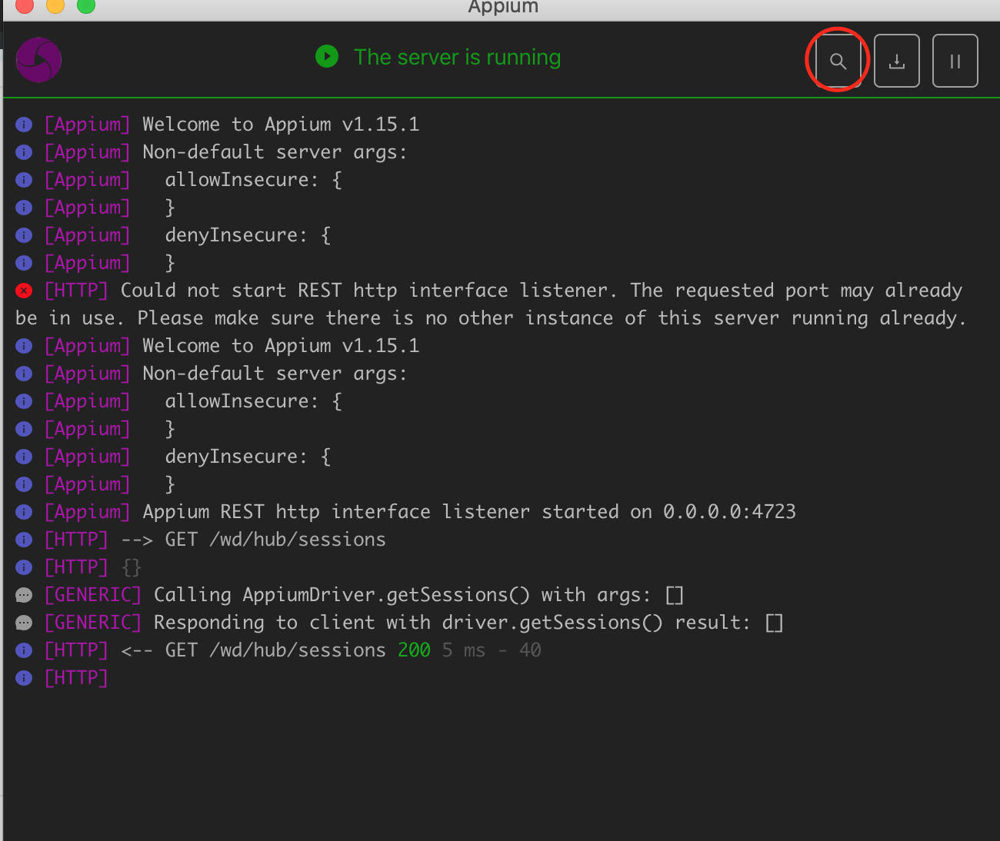

# test automator on appium server
* run android emulator , this example app use 8 version.
* edit ~/.zshrc (depends your shell, e.g. ~/.bashrc, ~/.bash_profile)
```
export JAVA_HOME="/Library/Java/JavaVirtualMachines/jdk1.8.0_111.jdk/Contents/Home"

```
* after edit .zshrc, open another tab or source .zshrc for refreshing terminal config

* install appium (need node 10+, use nvm)
```
npm install -g appium
```
* Or install appium desktop
* make working directory
```
mkdir ~/appium/test && cd "$_"
npm init -y
```
* install UiAutomator2Driver for android test
```
npm install appium-uiautomator2-driver
npm install webdriverio
```
* download demo android app [androidapp](https://github.com/appium/appium/raw/master/sample-code/apps/ApiDemos-debug.apk)
* run appium server
```
appium
```
* edit index.js
```
const wdio = require("webdriverio");
const assert = require("assert");

const opts = {
  hostname: "localhost",
  port: 4723,
  path: "/wd/hub/",
  capabilities: {
    platformName: "Android",
    platformVersion: "8",
    deviceName: "Android Emulator",
    app: "/your_home_dir/Downloads/ApiDemos-debug.apk",
    appPackage: "io.appium.android.apis",
    appActivity: ".view.TextFields",
    automationName: "UiAutomator2"
  }
};

async function main () {
  const client = await wdio.remote(opts);

  const field = await client.$("android.widget.EditText");
  await field.setValue("Hello World!");
  const value = await field.getText();
  assert.equal(value,"Hello World!");

  await client.deleteSession();
}

main();

```
* run node index for testing with appium server.
```
node index
```
# test automator on appium desktop
* run android emulator , this example app use 8 version.
* install appium desktop and click edit configurations

* edit as your config

* click start server button and click red circle below image.

* add params on Desired Capabilities with
```
    platformName: "Android",
    platformVersion: "8",
    deviceName: "Android Emulator",
    app: "/your_home_dir/Downloads/ApiDemos-debug.apk",
    appPackage: "io.appium.android.apis",
    appActivity: ".view.TextFields",
    automationName: "UiAutomator2"
```
* and save as , result will be like below

* and click start session
# IOS TEST
* npm uninstall -g appium && npm install -g appium@rc (최신버전 설치)
* Defora.app 을 xcode에서 왼쪽 창 products폴더 안에 있는 Defora.app을 복사 해서 써야한다. 아카이빙된 파일은 시뮬레이터에서 실행이 안된다.
* appium desktop은 포트는 4724로 실행
* terminal 에서 appium 실행 (default 값인 4723으로 실행된다)
* appium desktop에서 custom server 로 실행 - 즉 터미널에 실행되는 appium을 이용해야한다.
```
{
  "platformName": "iOS",
  "platformVersion": "12.1",
  "deviceName": "iPhone Simulator",
  "app": "/Users/byeongcheollim/Downloads/Defora.app",
  "automationName": "XCUITest",
  "showIOSLog": true,
  "showXcodeLog": true,
  "noReset": true,
  "usePrebuiltWDA": true
}
```